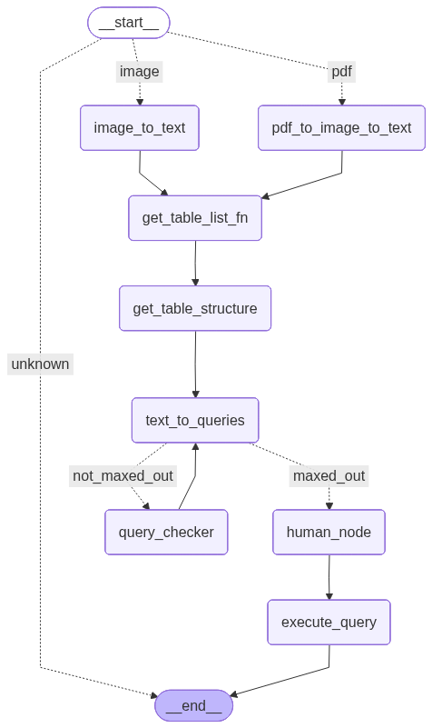

# Automated-Invoice-to-SQL-Workflow-Using-LangGraph
Built an automated workflow using LangGraph and LLMs that extracts text from invoice images, generates MySQL insert queries, and updates totals dynamically based on feedback. Includes human approval before execution for accurate, end-to-end invoice data automation.

##  Workflow Diagram

*(Diagram of LangGraph workflow showing the extraction, SQL generation, and approval process)*

## ⚙️ Features
- **Invoice Image Input** – Takes an invoice image for automatic data extraction  
- **Data Parsing with AI** – Extract fields like invoice number, vendor name, date, and total amount  
-  **SQL Query Generation** – Automatically generates SQL `INSERT` queries based on parsed data  
-  **Approval Workflow** – Inserts data into the database only after approval through a custom review node  
- **LangGraph Integration** – Manages and visualizes the complete automation flow  

##  Tech Stack
- **Python**
- **LangGraph**
- **LangChain**
- **SQL (MySQL)**
- **Groq**

Workflow Working

*(The video showcases how an invoice image is processed, converted into SQL, reviewed for approval, and inserted into the database.)*

